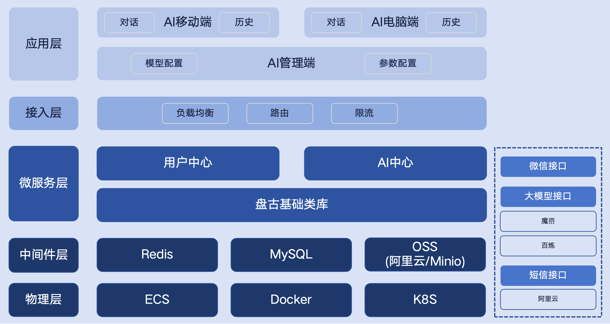
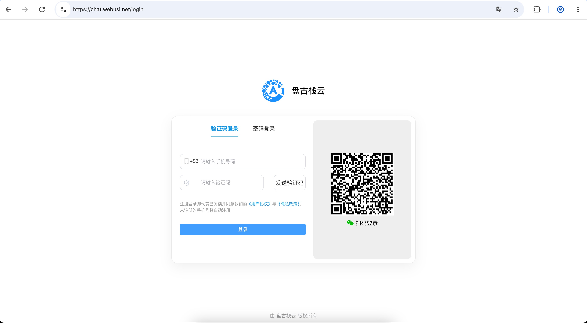
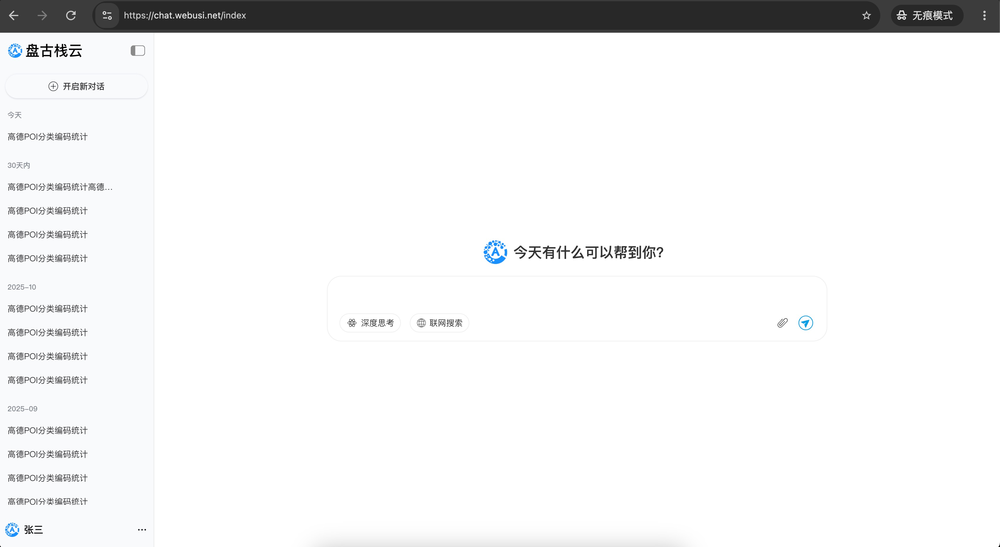
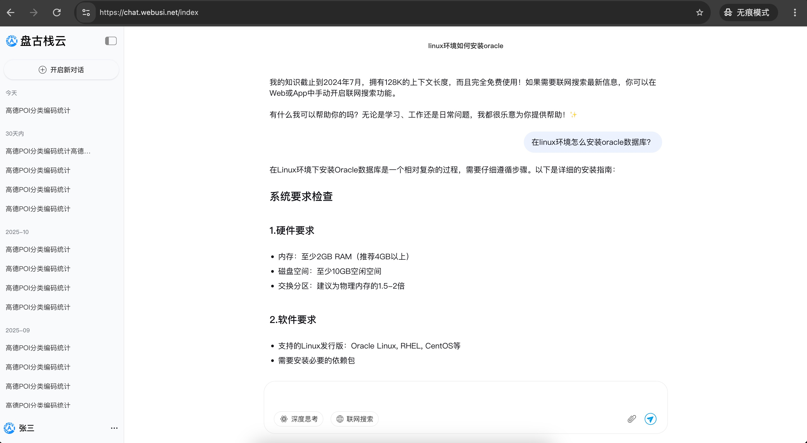
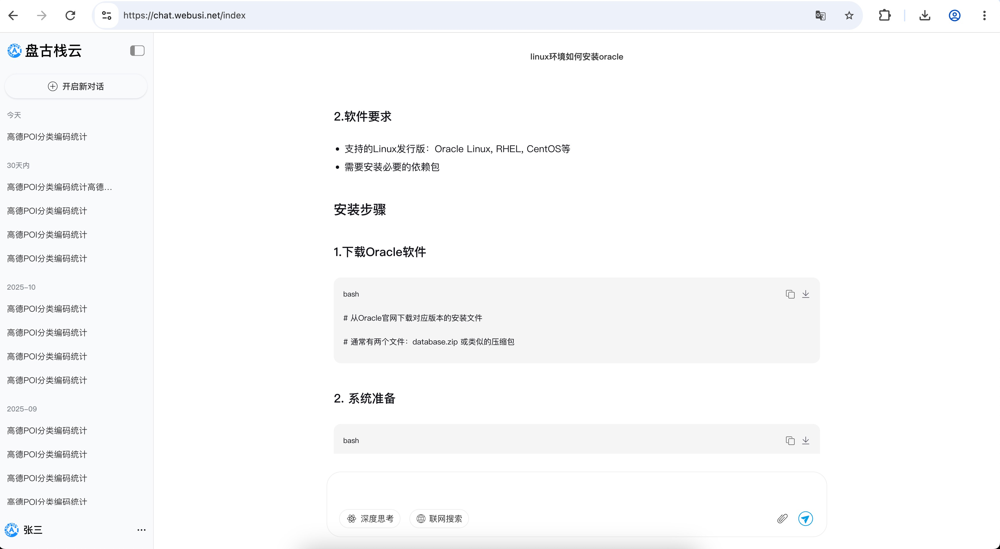
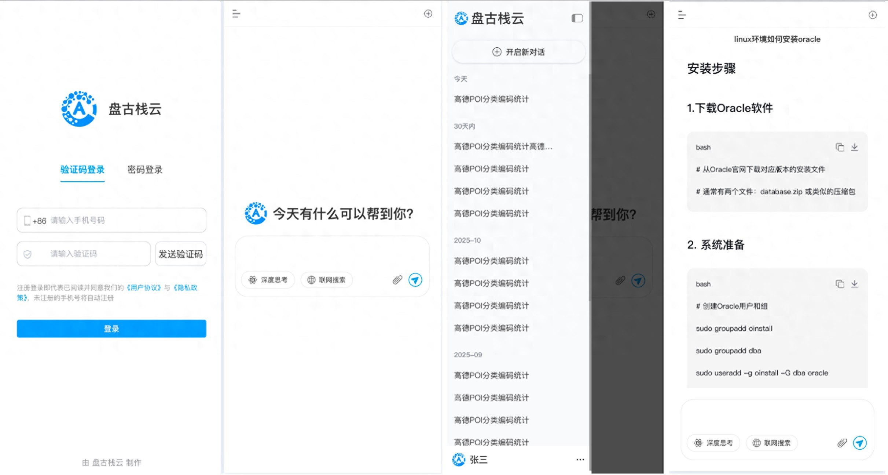

	

<h1 align="center" style="margin: 30px 0 30px; font-weight: bold;">仿deepseek 大模型对话 v1.3.0</h1>
<h4 align="center">基于vue3+css 仿deepseek 大模型对话 电脑端+移动端</h4>

	

## 简介
轻量级微服务架构 仿deepseek大模型对话 电脑端/移动端+管理端。

核心功能：流式对话/历史对话/内容下载/多平台模型切换(ollama、魔撘社区、阿里云百炼平台)/LLM应用中心

技术栈 
* Vue3、CSS、Element Plus、vant
* Spring Boot3
* Redis/MySQL/OSS

## 团队产品
https://www.webusi.net

## 演示地址
https://chat.webusi.net

## 最近更新
### 1.3.5 2026-01-08
#### 移动端/电脑端 同步更新
1.  功能：系统设置(绑定手机/绑定邮箱/修改昵称/绑定租户)
2.  功能：服务协议
3.  优化：优化界面

## 微信交流
<tr>
    <td></td>
</tr>

## 系统架构图
<tr>
    <td></td>
</tr>

## 电脑端
<tr>
    <td></td>
</tr>
<tr>
    <td></td>
</tr>
<tr>
    <td></td>
</tr>
<tr>
    <td></td>
</tr>

## 移动端
<tr>
    <td>
        
    </td>
</tr>
<tr>
    <td>
        
    </td>
</tr>

## 更新日志
### 1.3.0 2025-12-23
#### 移动端/电脑端
1.  功能：引入LLM应用中心
2.  功能：支持上传文档
3.  功能：调整消息内容
4.  优化：优化界面

### 1.2.0 2025-12-14
#### 移动端/电脑端
1.  功能：流式对话
2.  功能：复制和下载代码
3.  功能：内容格式化
4.  优化：优化界面

### 1.1.0 2025-12-04
#### 移动端/电脑端
1.  功能：短信登录/密码登录/微信扫码登录/登录退出
2.  功能：滑动验证码
3.  功能：历史会话
4.  功能：大模型对话
5.  功能：支持魔撘社区
6.  优化：优化界面

### 1.0.0 2025-11-22
1.  功能：移动端：登录界面/主界面
2.  功能：电脑端：登录界面/主界面
